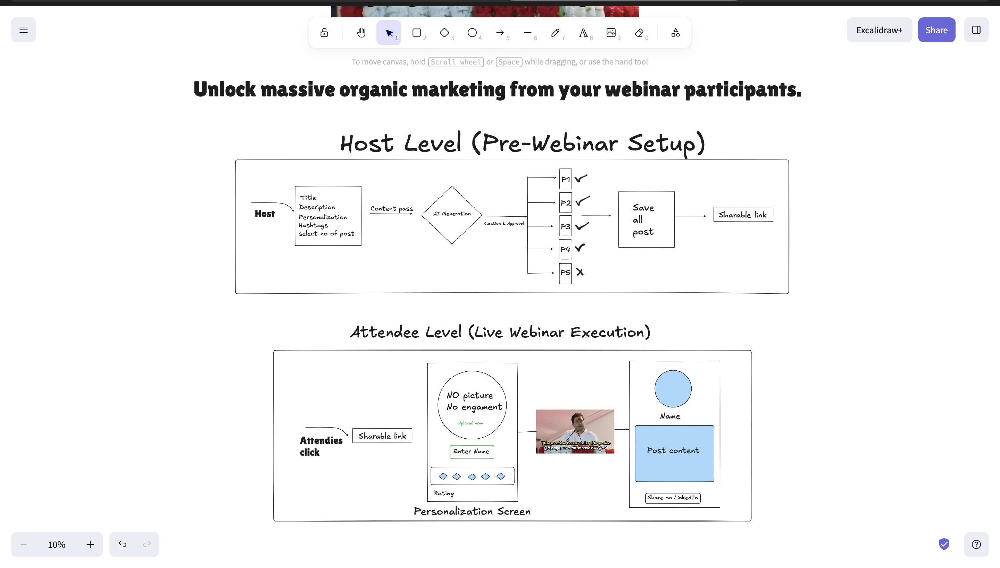
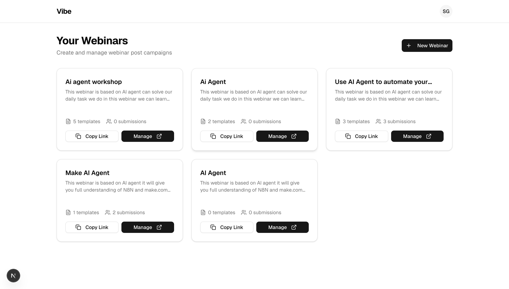
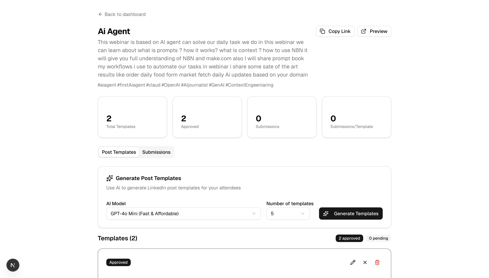

# 🎯 Webinar Brand Advocate — Turn Attendees Into Organic Marketers

> **The problem:** 1000 people attend a webinar. 50 post on LinkedIn. 950 close the tab.  
> **The reason:** Not laziness — it's blank page anxiety, creative fatigue, and fear of judgment.  
> **This tool:** Removes 100% of that friction. One click. Post ready. Done.

---

## 📸 Workflow Overview


---

## 💡 The Insight That Started This

I attended a webinar. The host was giving pure value — great energy, great content.  
At the end: *"Please share your feedback and tag me on LinkedIn!"*

Then I noticed a pattern.

Out of 1000 attendees, barely 50 actually posted. The rest closed the tab — not because they didn't want to help, but because:

- **Creative Fatigue** — Who has time to write a post from scratch after a 2-hour session?
- **Design Paralysis** — What do I write? How do I make it look good?
- **Judgment Anxiety** — Will my network think this is cringe?

**The key insight:**
> There is zero resistance to clicking a button.  
> There is huge resistance to creating from scratch.

So I shifted the creative work to the **host** — before the webinar even starts.  
The attendee's job? Just name + photo + one click.

---

## 🔄 How It Works

### Host Level — Pre-Webinar Setup

```
Host logs in
    → Enters: Title, Description, Personalization, Hashtags, No. of posts
    → AI generates 5 LinkedIn post templates
    → Host reviews, approves ✅ or regenerates 🔄
    → Approved posts saved → Single shareable link generated
```


---

### Attendee Level — Live Webinar Execution

```
Host drops link in webinar chat
    → Attendee clicks link
    → Enters: Name + Photo + Rating
    → Selects from host-approved templates (or writes custom)
    → Image generated via HTML to Canvas
    → Downloads image + text auto-copies to clipboard
    → One click → Redirected to LinkedIn post composer
    → Paste + Upload = Done
```


---

### LinkedIn Post Preview


---

## 📈 Impact

| Before This Tool | After This Tool |
|---|---|
| 50-100 posts from 1000 attendees | 300-400+ posts from same audience |
| 0% organic reach beyond registrants | Free reach into attendees' networks |
| Weak social proof | Massive hashtag presence + authority |
| One-time webinar visibility | Long-term trust + lead generation |

---

## 🛠️ Tech Stack

| Layer | Technology | Why |
|---|---|---|
| Frontend | Next.js | Fast, component-based, easy to deploy |
| Database | Supabase | Real-time DB + storage for submissions |
| AI | OpenRouter API | Flexible LLM routing, cost-efficient |
| Image Gen | HTML to Canvas | LinkedIn doesn't support direct image share — this converts the post card to a downloadable image |
| Hosting | Vercel | Zero-config deployment with Next.js |

---

## 🧠 Why OpenRouter Instead of Direct API

LinkedIn's sharing API doesn't allow direct image uploads programmatically from third-party apps — so I used **HTML to Canvas** to render the post card as an image client-side, which the user downloads and manually uploads. The text is auto-copied to clipboard.

For LLM — I initially ran this on **Local LLM via LM Studio** (zero cost, full privacy). The challenge: it took 5-6 minutes to generate 4 posts and crashed my Mac's RAM. So the hosted version uses **OpenRouter API** — same flexibility, multiple model options, much faster.

---

## ⚡ Challenges I Hit (And How I Fixed Them)

### 1. Thinking Model Output Leaking
When using a reasoning model, the internal "thinking" was reflecting into the final output — breaking the post format.  
**Fix:** Switched to a non-reasoning model. Cleaner output, consistent structure.

### 2. JSON Parsing Failures
The LLM was returning incomplete or malformed JSON for post templates.  
**Fix:** Added strict output format instructions in system prompt + fallback parsing logic.

### 3. LinkedIn Direct Share Limitation
LinkedIn's API doesn't allow third-party apps to post images directly.  
**Fix:** HTML to Canvas renders the post card → user downloads image → text auto-copies to clipboard → redirected to LinkedIn composer. Friction reduced from "create from scratch" to "paste + upload."

---

## 🚀 Getting Started

### Prerequisites
- Node.js 18+
- Supabase account
- OpenRouter API key

### Installation

```bash
git clone https://github.com/yourusername/webinar-brand-advocate
cd webinar-brand-advocate
npm install
```

### Environment Variables

Create a `.env.local` file:

```env
NEXT_PUBLIC_SUPABASE_URL=your_supabase_url
NEXT_PUBLIC_SUPABASE_ANON_KEY=your_supabase_anon_key
OPENROUTER_API_KEY=your_openrouter_api_key
```

### Run Locally

```bash
npm run dev
```

Open [http://localhost:3000](http://localhost:3000)

### Deploy

```bash
# Already configured for Vercel
vercel deploy
```

---

## 📁 Project Structure

```
webinar-brand-advocate/
├── app/
│   ├── host/           # Host dashboard — setup, template approval
│   ├── attend/         # Attendee flow — personalization + share
│   └── api/            # OpenRouter API calls, Supabase operations
├── components/
│   ├── PostCard/       # HTML to Canvas post renderer
│   ├── TemplateList/   # Approval UI for host
│   └── ShareFlow/      # Attendee submission + LinkedIn redirect
├── lib/
│   ├── supabase.ts     # DB client
│   └── llm.ts          # OpenRouter integration
├── docs/
│   └── images/         # ← Place all README screenshots here
└── README.md
```

---

## 🗄️ Database Schema (Supabase)

```sql
-- Webinars created by hosts
webinars (id, title, description, hashtags, host_id, shareable_link, created_at)

-- AI-generated + approved post templates
templates (id, webinar_id, content, is_approved, created_at)

-- Attendee submissions
submissions (id, webinar_id, attendee_name, photo_url, template_id, rating, posted_at)
```

---

## 🎯 Why I Built This

I'm actively building at the intersection of **AI + real business problems.**

This isn't a tutorial project. It came from a real observation — a real gap — and a real solution I shipped end to end.

My background: I ran **Scult India**, a marketing + AI agency. I've built tools used by 21,000+ users. I paused the agency intentionally to go deeper into GenAI — learning PyTorch, building proof of work, and targeting roles where I can contribute from day one.

This project is one piece of that proof.

If you're a founder building in the AI/SaaS space and want to talk — I'm open.  
**[LinkedIn →](https://linkedin.com/in/yourprofile)** | **[YouTube →](https://youtube.com/@yourchannel)**

---

## 📌 Image Placement Guide for GitHub

When you add your images to `docs/images/`, replace the placeholder blocks above with:

```markdown




```

**Recommended image sizes for GitHub README:**
- Workflow diagram: full width (no resize needed)
- Dashboard + screens: add `width="700"` in HTML img tag for cleaner layout

```html

```

---

## 📄 License

MIT — use it, fork it, build on it.
# Pre_Webinar.ai
# Pre_Webinar.ai
